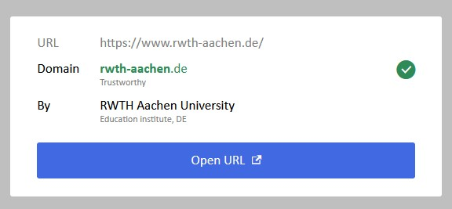

# SafeLink

SafeLink is an extension for the email client Thunderbird and allows to investigate links contained in emails before accessing them.
For this, the user just needs to click on the particular link. Two clicks for more safety!

## Project structure
This project is divided into three parts:

### Extension
In the extension folder is placed the source code of the extension.

### Docs
The markdown files in this folder contain the user docs for the extension and further information about phishing protection.

### Lists
Here, you can find curated lists of trusted hosts, redirection services and organizations.
This lists are fetched by the installed extension.

## Screenshots

If a domain is listed as trusted hosts this modal is shown.
Furthermore, relevant information about the organization that owns the domain are displayed.

If a domain is listed on one of the phishing and malware blacklists this modal is shown.

If a domain belongs to a redirection service, like Bitly, this modal is shown.
Here, the user is informed that criminals can try to use such service to veil a malicious site.

In all other cases, there is no knowledge about the domain.
The user must check the domain himself to be absolutely certain. 

## License
 
The extension source code is licensed under GPLv3

The documention and lists are licensed under CC BY 4.0 